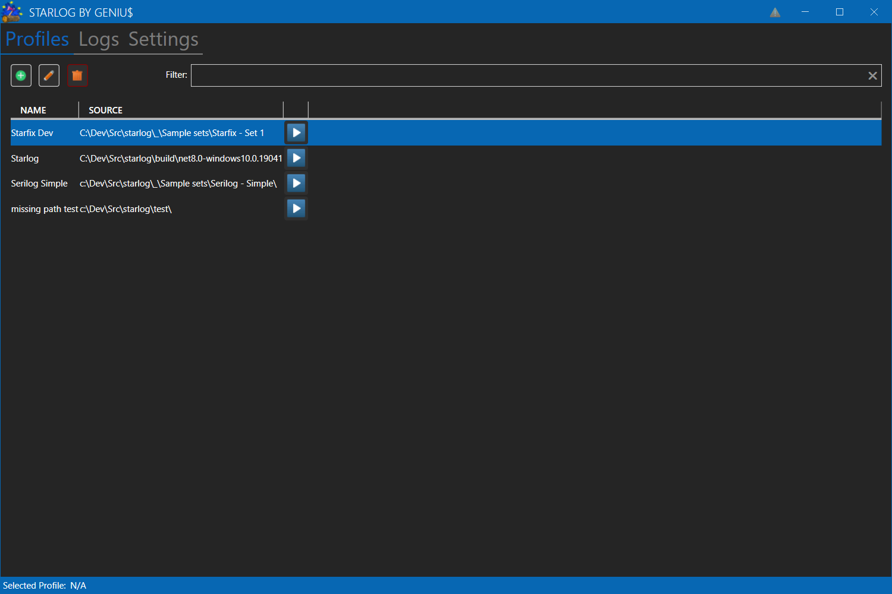
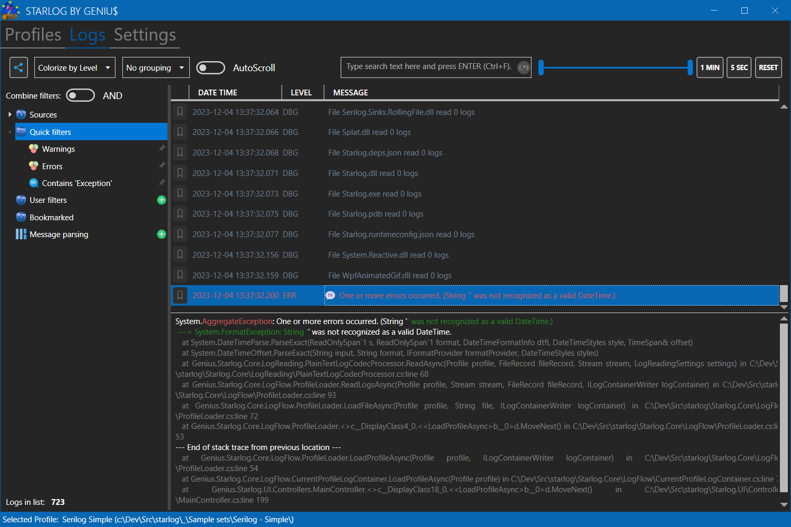
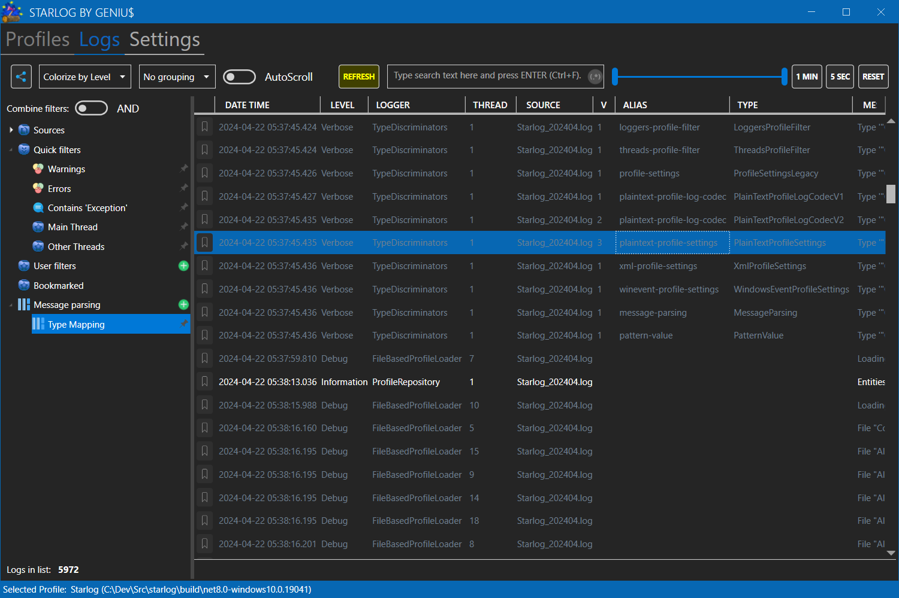
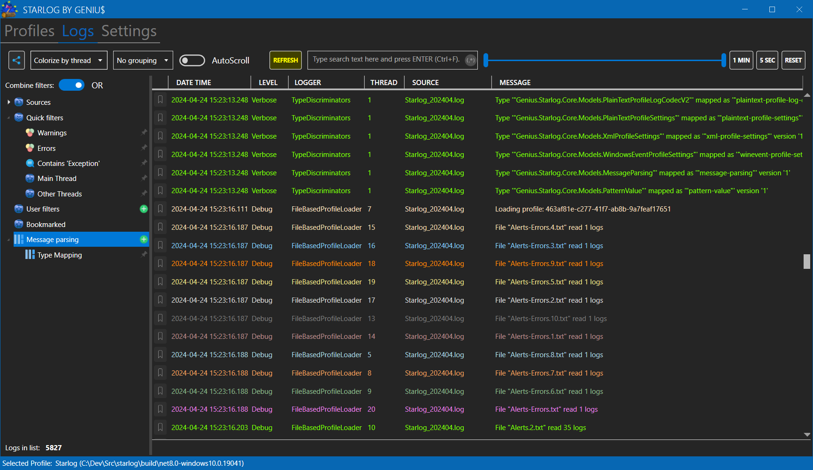
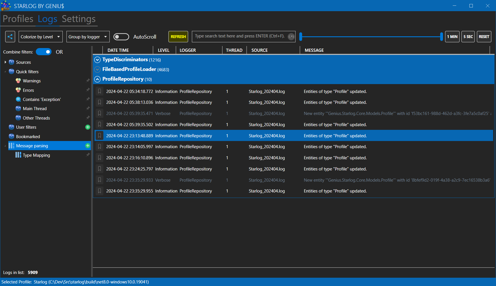
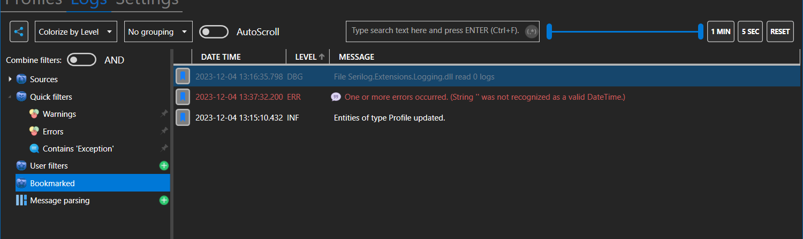
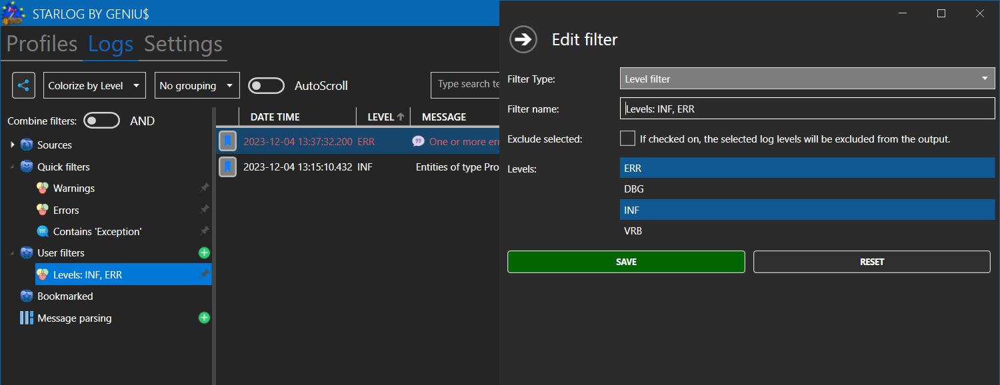
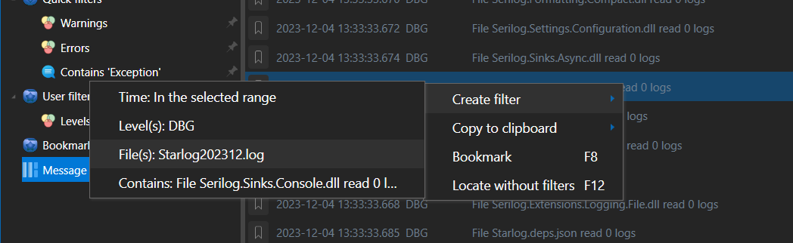
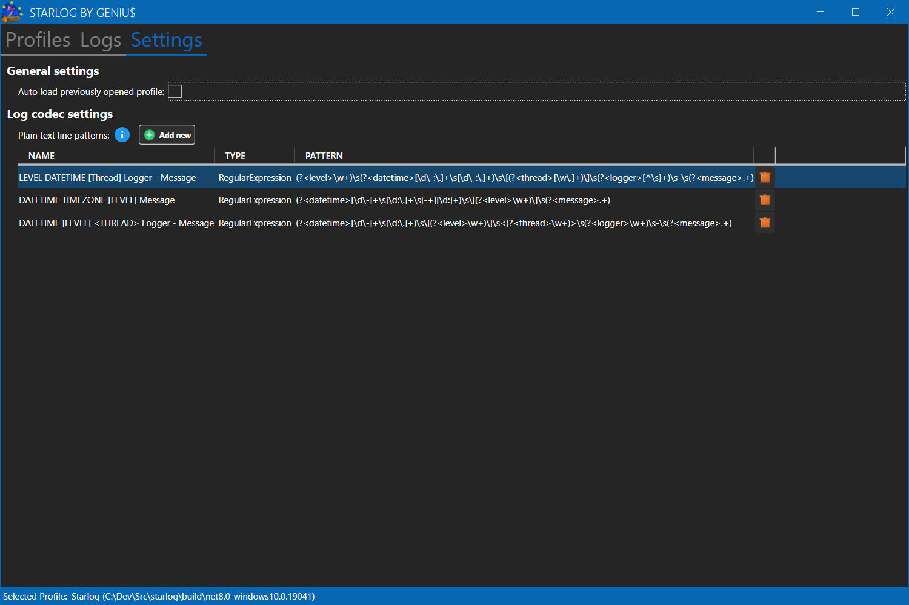

# Screenshot Gallery

## Profiles

## Logs

* Artifacts Footage

  
* Parsed content as columns

  
* Colorization by thread

  
* Grouping by logger

  
* Bookmarks

  
* Filter modification

  
* Context menu

  

## Settings

